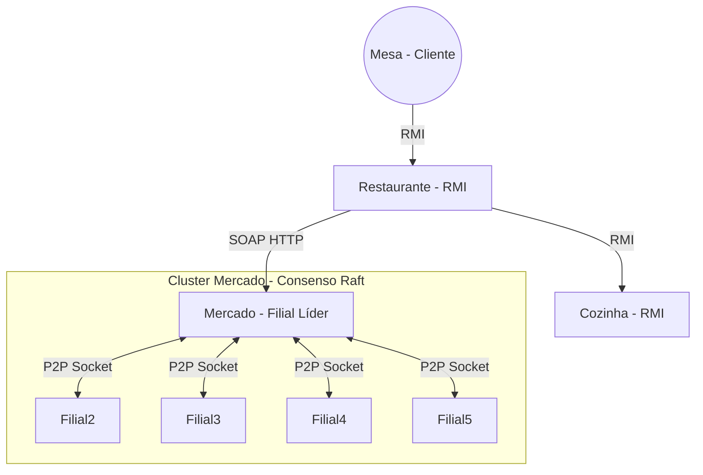

# Restaurante Distribuído (SDI)


Projeto acadêmico desenvolvido em Java que simula o ecossistema de um restaurante distribuído. O sistema integra tecnologias clássicas de middleware (RMI e SOAP) com a implementação de um **algoritmo de consenso (Raft)** para replicação de estoque e tolerância a falhas.

**Autor:** Lucas Thomas

---

## 📋 Sumário

- [Arquitetura](#-arquitetura)
- [Tecnologias](#-tecnologias)
- [Pré-requisitos](#-pré-requisitos)
- [Como Executar](#-como-executar-passo-a-passo)
- [Configuração de Portas](#-portas-e-endpoints)
- [Testando Tolerância a Falhas](#-testando-a-tolerância-a-falhas-raft)
- [Estrutura do Projeto](#-estrutura-do-repositório)

---

## 🏛 Arquitetura

O sistema é composto por quatro módulos principais que se comunicam via rede:

1.  **Mesa (Cliente):** Interface CLI onde o cliente faz pedidos.
2.  **Restaurante (Servidor RMI):** Orquestrador. Recebe pedidos, consulta estoque no Mercado (SOAP) e encaminha para a Cozinha.
3.  **Cozinha (Servidor RMI):** Simula o preparo assíncrono dos pratos.
4.  **Mercado (Cluster Raft):** Cluster de filiais que mantém o estoque sincronizado via algoritmo Raft (Leader Election + Heartbeats). Apenas o **Líder** publica o serviço SOAP.

### Diagrama de Componentes



## 🛠 Tecnologias

* **Java JDK 8+**: Linguagem de programação base utilizada em todo o projeto.
* **Java RMI (Remote Method Invocation)**: Middleware utilizado para a comunicação remota síncrona entre os componentes Mesa, Restaurante e Cozinha.
* **JAX-WS (Java API for XML Web Services)**: Framework utilizado para implementar o serviço web SOAP. Permite que o Restaurante consuma o serviço de compras exposto apenas pela filial Líder do Mercado.
* **Java Sockets (`java.net`)**: Implementação de baixo nível para a comunicação TCP ponto-a-ponto (P2P) entre as filiais. Essencial para a troca de mensagens do algoritmo Raft (votos, heartbeats e replicação de logs).
* **Multithreading**: Utilizado extensivamente para gerir a concorrência no servidor da Cozinha (preparos simultâneos) e no Mercado (timers de eleição e threads de escuta de sockets).

## Pré-requisitos

- Java JDK 8 ou superior
- `make` (Makefile incluso)
- Terminais: Recomenda-se abrir pelo menos 8 abas de terminal para visualizar os logs de cada nó distribuído.

## 🚀 Como Executar (Passo a Passo)

Utilize terminais separados para cada comando abaixo para simular o ambiente distribuído.

1) Compilar

Na raiz do projeto:

```bash
make        # compila todo o código
```

2) Iniciar os RMI registries:

```bash
make run_rmi_cozinha      # inicia rmiregistry para a Cozinha (porta 1096)
make run_rmi_restaurante  # inicia rmiregistry para o Restaurante (porta 1110)
```

2) Servidores de Negócio:

```bash
make run_cozinha         # executa restauranteSDI.server.CozinhaServer
make run_restaurante     # executa restauranteSDI.server.RestauranteServer
```

3) Cluster do Mercado (Raft)

Inicie as 5 filiais. Elas conversarão entre si para eleger um líder.

```bash
make run_filial1   # Filial 1
make run_filial2   # Filial 2
make run_filial3   # Filial 3
make run_filial4   # Filial 4
make run_filial5   # Filial 5
```

Nota: Observe os logs. Uma filial se tornará LEADER e publicará o SOAP na porta 9000. As outras serão FOLLOWER.

4) Cliente:

```bash
make run_cliente
```

## 🧪 Testando a Tolerância a Falhas (Raft)

O diferencial deste projeto é a resiliência do Mercado. Para testar:

1.  **Identifique o Líder:** Com o cluster rodando, verifique nos terminais das filiais qual delas está com o status `LEADER` (exibirá a mensagem `EU SOU O LÍDER`).
2.  **Simule a Falha:** Vá até o terminal desse Líder e encerre o processo (pressione `Ctrl+C`).
3.  **Observe a Reação:** Nos terminais das outras filiais (Followers):
    * O timeout de heartbeat irá expirar (mensagem `TIMEOUT! Iniciando Eleição`).
    * Uma nova eleição será convocada imediatamente.
    * Um novo Líder será eleito e assumirá a porta SOAP `9000` automaticamente.
4.  **Verifique a Continuidade:** O Restaurante continuará conseguindo realizar compras normalmente após a breve pausa da eleição.

## 🔌 Portas e Endpoints

Configuração atual definida no `Makefile` e nas classes Java:

| Componente | Tecnologia | Porta / URL | Descrição |
| :--- | :--- | :--- | :--- |
| **Cozinha** | RMI Registry | `1096` | Registro de serviços da cozinha |
| **Restaurante** | RMI Registry | `1110` | Registro de serviços do restaurante |
| **Mercado (Líder)** | SOAP (HTTP) | `9000` | Endpoint do Web Service (`http://localhost:9000/mercado`) |
| **Filiais (Raft)** | Socket TCP | `5001` a `5005` | Comunicação interna P2P entre nós do cluster |

## 📂 Estrutura do Repositório

```
RestauranteSDI/
├── bin/                       # Arquivos .class compilados
├── data/                      # Persistência (Cardápio e Estoques CSV)
├── src/restauranteSDI/
│   ├── client/                # MesaCliente, MercadoCliente
│   ├── interfaces/            # Interfaces RMI e SOAP
│   └── server/
│       ├── Cozinha*.java      # Lógica da Cozinha
│       ├── Restaurante*.java  # Lógica do Restaurante
│       ├── Mercado*.java      # Implementação SOAP
│       └── Filial.java        # Lógica do Algoritmo Raft (P2P)
├── Makefile                   # Automação de compilação e execução
└── README.md                  # Documentação
```

